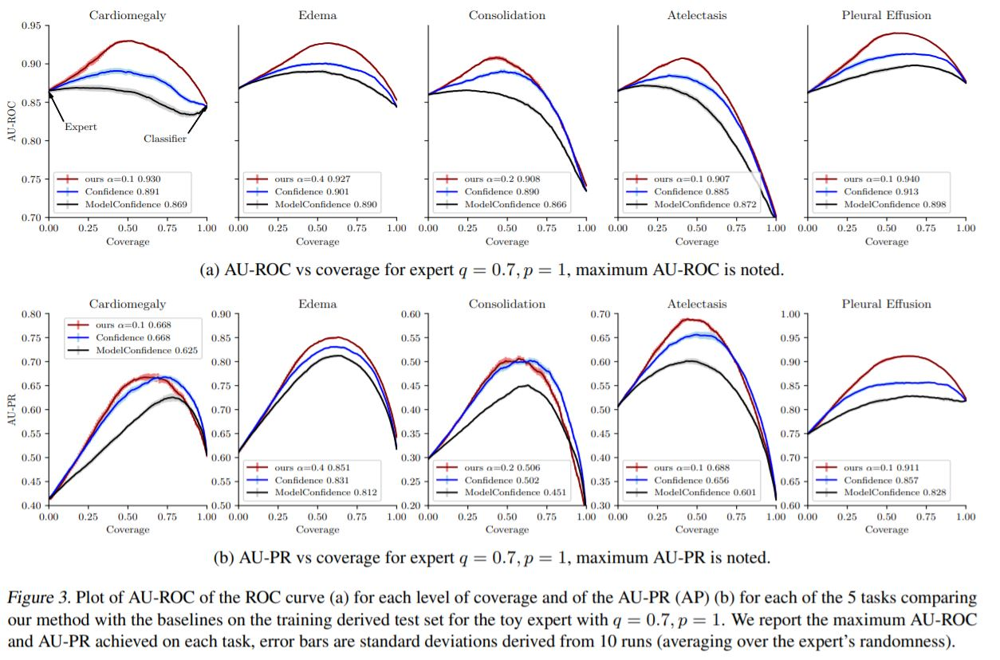

## CheXpert experiments

We include a jupyter notebook that allows one to recreate Figure 3 in our ICML camera ready (see below) that evaluates our method and two baselines on the five competition tasks of [CheXpert](https://stanfordmlgroup.github.io/competitions/chexpert/).  Note this requires one to download the downsampled version of CheXpert (~10GB) first.

*  [cheXpert_defer_synthetic.ipynb](cheXpert_defer_synthetic.ipynb) reproduces Figure 3 in the paper, we use a synthetic expert described in the paper.

